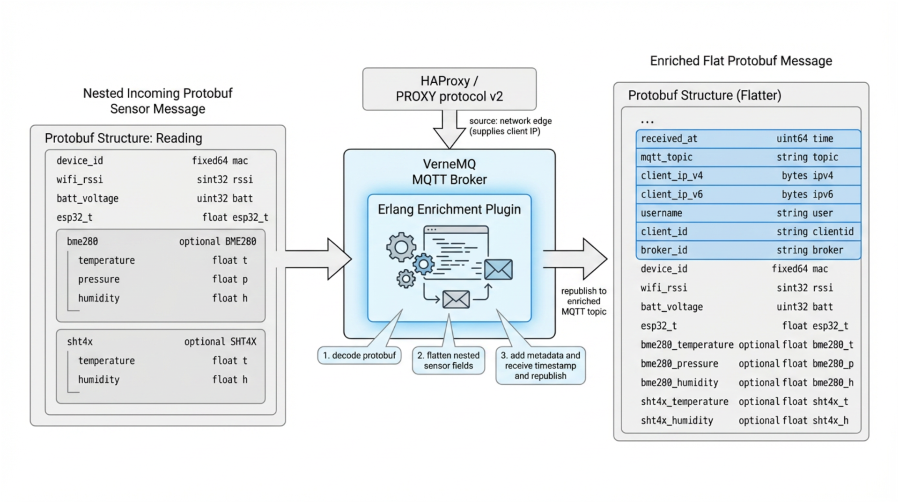

# vernemq-enrich-msg

[https://github.com/pvamos/vernemq-enrich-msg](https://github.com/pvamos/vernemq-enrich-msg)

A lightweight **VerneMQ plugin** that enriches incoming MQTT publishes and republishes them to mapped MQTT topics on the same broker.

The current project is optimized for an environmental monitoring pipeline where ESP32 sensor nodes publish binary `envsensor.Reading` Protocol Buffers messages. The plugin decodes those input messages, adds broker-side metadata such as receive timestamp and client network information, flattens the sensor fields, and republishes a new binary `envsensor.vernemq.EnrichedReading` protobuf message.

> **Public repository note:** the private version of this repository uses deployment-specific values such as private container registry names, image tags, MQTT topic names, site/device identifiers, example usernames, broker node names, IP addresses, Helm values, and debug examples. The public repository should contain placeholders only. Replace those placeholders with your real deployment values before use, either by editing a private clone directly or by keeping public files unchanged and supplying private Helm values/environment variables. See [Sensitive configuration and public-release checklist](#-sensitive-configuration-and-public-release-checklist) and [Replace placeholders before use](#-replace-placeholders-before-use).

---

## 👨‍🔬 Author

**Péter Vámos**

* [https://github.com/pvamos](https://github.com/pvamos)
* [https://linkedin.com/in/pvamos](https://linkedin.com/in/pvamos)
* [pvamos@gmail.com](mailto:pvamos@gmail.com)

---

## 🎓 Academic context

This project is part of the infrastructure work supporting the author's **2026 thesis project**
for the **Expert in Applied Environmental Studies BSc** program at **John Wesley Theological College, Budapest**.

The plugin supports an environmental monitoring stack built around ESP32 sensor nodes, VerneMQ MQTT, Apache Kafka, Kafka Connect, ClickHouse and Grafana.

---

## 📜 Overview



The plugin runs inside VerneMQ and hooks into MQTT register/publish events.

Current behavior:

* ✅ captures the remote client IP during MQTT client registration
* ✅ supports HAProxy **PROXY protocol v2** when VerneMQ is behind HAProxy
* ✅ filters incoming MQTT topics by `VMQ_ENRICH_ACCEPT`
* ✅ maps incoming topics to enriched output topics using MQTT wildcard rules
* ✅ decodes the incoming payload as `envsensor.Reading` protobuf
* ✅ enriches the payload with timestamp, source topic, user, client ID, broker name and client IP, depending on configuration
* ✅ flattens sensor fields from BME280 and SHT4X/SHT41 readings
* ✅ republishes the enriched message to the same VerneMQ cluster using `vmq_reg:publish/4`
* ✅ emits binary protobuf output only in the current code path
* ✅ supports output-size guardrails and configurable logging

The current code is a **protobuf-only pipeline**. Older README text and some older test code may still refer to JSON output or `VMQ_ENRICH_FORMAT`; those paths are not the active behavior of the current implementation.

---

## 🧭 Data flow

```text
ESP32 sensor node
  └─ publishes envsensor.Reading protobuf
      └─ VerneMQ receives MQTT publish
          └─ vmq_enrich plugin filters accepted topics
              └─ plugin decodes Reading protobuf
                  └─ plugin adds broker-side metadata
                      └─ plugin publishes EnrichedReading protobuf
                          └─ downstream MQTT/Kafka/ClickHouse pipeline consumes enriched topic
```

Example topic flow:

```text
envsensor/site-a/device-001
  → envsensor-enriched/site-a/device-001
```

---

## 📁 Project directory structure

```text
vernemq-enrich-msg/
|
├── Dockerfile                         # Multi-stage VerneMQ plugin image build
├── rebar.config                       # Erlang/rebar3 build configuration
├── proto/
│   ├── reading.proto                  # Input ESP32 sensor protobuf schema
│   └── enriched_reading.proto         # Output enriched protobuf schema
├── src/
│   ├── vmq_enrich.erl                 # VerneMQ hook handlers, filtering, mapping, enrichment, republish
│   ├── vmq_enrich_app.erl             # OTP application callback and config snapshot logging
│   ├── vmq_enrich_config.erl          # Environment variable parsing and validation
│   ├── vmq_enrich_log.erl             # Small logger wrapper with runtime log threshold
│   ├── vmq_enrich_pb.erl              # Legacy/simple EnrichedPublish protobuf encoder
│   ├── vmq_enrich_reading_pb.erl      # Minimal Reading decoder and EnrichedReading encoder
│   └── vmq_enrich_state.erl           # ETS client ID → peer IP mapping
├── test/
│   └── vmq_enrich_tests.erl           # EUnit tests; review/update if testing current protobuf-only behavior
├── examples/
│   └── values.vernemq.yaml            # Example Helm values for running the image with VerneMQ
├── LICENSE
└── README.md
```

---

## ⚙️ Prerequisites

### Build environment

To build locally without Docker/Podman, use Erlang/OTP and rebar3 compatible with VerneMQ's runtime.

The provided Dockerfile builds inside the VerneMQ image and downloads the VerneMQ header files needed by the plugin. This is the recommended path.

Required tools for the common workflow:

```bash
podman --version
# or
docker --version
```

Optional local test tooling:

```bash
rebar3 --version
```

### Runtime environment

The plugin is intended to run inside a VerneMQ container image.

The Dockerfile currently uses:

```text
vernemq/vernemq:2.1.2-alpine
```

The plugin depends on VerneMQ hook APIs and internal modules such as `vmq_reg`, `vmq_topic`, `vmq_msg` and `vmq_mqtt_fsm_util`.

---

## 🧬 Input protobuf schema

The incoming MQTT payload must be an `envsensor.Reading` protobuf message.

```proto
syntax = "proto3";
package envsensor;

message BME280 { float t = 1; float p = 2; float h = 3; }
message SHT4X  { float t = 1; float h = 2; }

message Reading {
  fixed64 mac   = 1;
  sint32 rssi   = 2;
  uint32 batt   = 3;
  float esp32_t = 4;

  optional BME280 bme280 = 5;
  optional SHT4X  sht4x  = 6;
}
```

The plugin drops messages that cannot be decoded as this protobuf schema.

---

## 📦 Output protobuf schema

The republished MQTT payload is an `envsensor.vernemq.EnrichedReading` protobuf message.

```proto
syntax = "proto3";
package envsensor.vernemq;

message EnrichedReading {
  // Metadata
  uint64 time = 1;     // nanoseconds since Unix epoch
  string topic = 2;
  bytes ipv4 = 3;      // 4 bytes
  bytes ipv6 = 4;      // 16 bytes
  string user = 5;
  string clientid = 6;
  string broker = 7;

  // Flattened Reading
  fixed64 mac = 8;

  sint32 rssi   = 9;
  uint32 batt   = 10;
  float  esp32_t = 11;

  optional float bme280_t = 12;
  optional float bme280_p = 13;
  optional float bme280_h = 14;

  optional float sht4x_t  = 15;
  optional float sht4x_h  = 16;
}
```

Field notes:

| Field | Meaning |
|---|---|
| `time` | Broker-side receive/enrichment timestamp in nanoseconds since Unix epoch. |
| `topic` | Original incoming topic, if `VMQ_ENRICH_INCLUDE_TOPIC=true`. |
| `ipv4` / `ipv6` | Client IP captured during registration or MQTT 5 peer fallback, encoded as raw bytes. |
| `user` | MQTT username, if `VMQ_ENRICH_INCLUDE_USER=true`. |
| `clientid` | MQTT client ID, if `VMQ_ENRICH_INCLUDE_CLIENTID=true`. |
| `broker` | Erlang node name, if `VMQ_ENRICH_INCLUDE_BROKER=true`. |
| `mac` | ESP32 MAC from the original Reading payload. |
| `rssi` | Wi-Fi RSSI from the original Reading payload. |
| `batt` | Battery value from the original Reading payload. |
| `esp32_t` | ESP32 die temperature from the original Reading payload. |
| `bme280_*` | Flattened BME280 values if present in the original Reading. |
| `sht4x_*` | Flattened SHT4X/SHT41 values if present in the original Reading. |

---

## 🔧 Configuration

The plugin is configured through environment variables.

| Variable | Purpose | Default / example |
|---|---|---|
| `VMQ_ENRICH_ACCEPT` | Comma-separated inbound topic allowlist. Supports MQTT `+` and `#`. Empty/unset means accept all. | `envsensor/#` |
| `VMQ_ENRICH_TOPIC_MAP` | JSON array of mapping rules. Each rule has `in` and `out`. First match wins. | `[{
"in":"envsensor/+/#","out":"envsensor-enriched/{1}/{2}"}]` |
| `VMQ_ENRICH_DEFAULT_TARGET` | Optional fallback output topic template if accepted but no rule matches. Supports `{topic}`. If unset, unmatched messages are dropped. | `envsensor-enriched/{topic}` |
| `VMQ_ENRICH_QOS` | QoS for republished enriched message: `0`, `1`, or `2`. | `1` |
| `VMQ_ENRICH_RETAIN` | Retain flag for the enriched publish. | `false` |
| `VMQ_ENRICH_MAX_OUTPUT_SIZE` | Output protobuf size guardrail in bytes. Messages larger than this are dropped. | `1048576` |
| `VMQ_ENRICH_MAX_JSON_SIZE` | Legacy compatibility alias for max output size if `VMQ_ENRICH_MAX_OUTPUT_SIZE` is not set. | `1048576` |
| `VMQ_ENRICH_INCLUDE_TOPIC` | Include original topic in the enriched protobuf. | `true` |
| `VMQ_ENRICH_INCLUDE_USER` | Include MQTT username. | `true` |
| `VMQ_ENRICH_INCLUDE_CLIENTID` | Include MQTT client ID. | `true` |
| `VMQ_ENRICH_INCLUDE_BROKER` | Include Erlang broker node name. | `true` |
| `VMQ_ENRICH_LOG_LEVEL` | Log threshold: `error`, `warning`, `notice`, `info`, or `debug`. | `info` |
| `VMQ_ENRICH_LOG_PAYLOAD_SAMPLE` | Log the first 64 bytes of the original payload at debug level. Keep disabled in production. | `false` |

### Topic mapping example

```bash
VMQ_ENRICH_ACCEPT='envsensor/#'
VMQ_ENRICH_TOPIC_MAP='[
  {"in":"envsensor/+/#", "out":"envsensor-enriched/{1}/{2}"},
  {"in":"devices/+",     "out":"envsensor-enriched/devices/{1}"}
]'
VMQ_ENRICH_DEFAULT_TARGET='envsensor-enriched/{topic}'
```

Example mappings:

| Incoming topic | Rule | Captures | Output topic |
|---|---|---|---|
| `envsensor/site-a/device-001` | `envsensor/+/#` | `{1}=site-a`, `{2}=device-001` | `envsensor-enriched/site-a/device-001` |
| `devices/node-7` | `devices/+` | `{1}=node-7` | `envsensor-enriched/devices/node-7` |
| `other/topic` | no rule, fallback | `{topic}=other/topic` | `envsensor-enriched/other/topic` |

Wildcard details:

* `+` captures one topic segment.
* `#` captures the remaining topic suffix as one capture.
* `{topic}` substitutes the complete incoming topic.

---

## 🌐 Client IP extraction

The plugin tries to attach the real MQTT client IP address to the enriched message.

Order of preference:

1. `auth_on_register` / `auth_on_register_m5` hook peer value captured at client registration time.
2. MQTT 5 `peer` / `peername` properties, if available.
3. Empty IP if no peer information is available.

If VerneMQ is behind HAProxy and the listener has **PROXY protocol v2** enabled, the hook peer value should contain the original sensor/client IP instead of the HAProxy source IP.

IPv4-mapped IPv6 addresses such as `::ffff:84.0.24.7` are normalized to plain IPv4.

---

## 🐳 Build the image

Build with Podman:

```bash
podman build -t registry.example.com/example/vernemq-enrich-msg:0.0.0 .
```

Push:

```bash
podman push registry.example.com/example/vernemq-enrich-msg:0.0.0
```

Docker works similarly:

```bash
docker build -t registry.example.com/example/vernemq-enrich-msg:0.0.0 .
docker push registry.example.com/example/vernemq-enrich-msg:0.0.0
```

---

## 🚀 Run with VerneMQ

A minimal local run can be used to confirm that VerneMQ starts and the plugin loads.

```bash
docker run --rm -it -p 1883:1883 \
  -e DOCKER_VERNEMQ_ACCEPT_EULA=yes \
  -e DOCKER_VERNEMQ_ALLOW_ANONYMOUS=on \
  -e DOCKER_VERNEMQ_PLUGINS__VMQ_ENRICH=on \
  -e VMQ_ENRICH_ACCEPT='envsensor/#' \
  -e VMQ_ENRICH_TOPIC_MAP='[{"in":"envsensor/+/#","out":"envsensor-enriched/{1}/{2}"}]' \
  -e VMQ_ENRICH_QOS=1 \
  -e VMQ_ENRICH_RETAIN=false \
  -e VMQ_ENRICH_LOG_LEVEL=debug \
  registry.example.com/example/vernemq-enrich-msg:0.0.0
```

The current plugin expects incoming payloads to be valid `envsensor.Reading` protobuf messages. Publishing plain text with `mosquitto_pub -m hello` is useful only to verify that the plugin drops non-protobuf payloads and logs the decode failure.

---

## 🧭 Roadmap / recommended improvements

* Remove or update legacy JSON-related README/test references.
* Update EUnit tests to validate the current protobuf-only `EnrichedReading` pipeline.
* Add generated sample protobuf payloads with synthetic data for local testing.
* Add CI that builds the Docker image and runs `rebar3 eunit`.
* Add a `values.example.yaml` that contains placeholders only.
* Add a private override values example for Kubernetes/Helm deployments.
* Add loop-prevention guardrails for output topics that match accepted input topics.
* Add metrics counters for accepted, dropped, decoded, oversized and republished messages.
* Consider externalizing schema/version metadata in output messages.

---

## ⚓ Helm values example

The repository includes an example values file under:

```text
examples/values.vernemq.yaml
```

For a public repository, image repository, tag, topics and node selectors should use placeholders.

---

## ⚠️ Operational cautions

This plugin runs in the VerneMQ broker process. Review configuration before production use.

Important considerations:

* Invalid/non-`envsensor.Reading` payloads are dropped.
* Topic maps can create loops if output topics are also accepted by `VMQ_ENRICH_ACCEPT`.
* `VMQ_ENRICH_LOG_PAYLOAD_SAMPLE=true` can leak raw payload data.
* Including `user`, `clientid`, `broker`, source topic and source IP in output messages can expose deployment metadata to downstream consumers.
* Output QoS `1` or `2` increases reliability but also increases broker load.
* The enriched output size limit should be set low enough to protect the broker from unexpectedly large payloads.

Avoid loops by making input and output prefixes distinct, for example:

```text
input:  envsensor/#
output: envsensor-enriched/#
```

---

## 🧪 Development and tests

### Build locally with rebar3

```bash
rebar3 compile
```

Production profile:

```bash
rebar3 as prod compile
```

### Run tests

```bash
rebar3 eunit
```

Note: the current source code is protobuf-only. If tests still assert older JSON envelope behavior, update them to decode and validate `envsensor.vernemq.EnrichedReading` instead.

---

## 🔐 Sensitive configuration and public-release checklist

Before making this repository public, remove or mask the following information from the working tree **and from git history**.

| Information | File/location | Why mask it | Public placeholder example |
|---|---|---|---|
| Container registry hostname | `README.md`, `examples/values.vernemq.yaml`, CI/build scripts | Reveals private registry and project namespace. | `registry.example.com/example/vernemq-enrich-msg` |
| Image tags | `README.md`, `examples/values.vernemq.yaml` | Can reveal private release cadence or internal deployment state. | `0.0.0` |
| Image pull secrets | Helm values or deployment manifests | Grants or identifies private registry access. | `example-registry-pull-secret` |
| MQTT inbound topic prefixes | `VMQ_ENRICH_ACCEPT`, `VMQ_ENRICH_TOPIC_MAP`, examples | May reveal site, customer, device, address or location naming. | `envsensor/example-site/#` |
| MQTT output topic prefixes | `VMQ_ENRICH_TOPIC_MAP`, `VMQ_ENRICH_DEFAULT_TARGET` | Reveals internal pipeline topic taxonomy. | `envsensor-enriched/{topic}` |
| MQTT usernames | examples, Helm values, logs | May reveal device names or service account names. | `example-device`, `kafka-connect` |
| Device IDs / site names | topic examples, test data, docs | Can reveal deployment topology and sensor locations. | `example-site`, `device-001` |
| Client IDs | logs, examples, test data | Can identify real devices or services. | `example-client-id` |
| Client IP addresses | enriched payload, logs, test samples | Reveals sensor source networks and public IPs. | `203.0.113.45` |
| Broker node names | enriched payload, logs | Can reveal Kubernetes namespace, service, pod or cluster naming. | `VerneMQ@example-broker` |
| Payload samples | logs when `VMQ_ENRICH_LOG_PAYLOAD_SAMPLE=true` | Can leak raw sensor payloads, MAC addresses, site data or binary device identifiers. | keep disabled |
| MAC addresses | input/output protobuf data and logs | Device identifier. | synthetic `fixed64` sample only |
| Helm node selectors | `examples/values.vernemq.yaml` | May reveal cluster role naming conventions. | generic labels only |
| Auth files / MQTT password files | mounted VerneMQ auth PVC examples | Grants MQTT broker access. | never commit real `vmq.passwd` |
| Logs and crash dumps | `logs/`, `log/`, `erl_crash.dump`, shell output | Can contain topics, usernames, payload samples, IPs and stack traces. | do not commit |

### Important: rotate exposed secrets

If any real secrets or identifying values were committed, replacing them in the latest commit is not enough. The old values remain recoverable from git history.

For a public release:

1. Rotate registry tokens or image pull credentials.
2. Rotate MQTT passwords and service credentials.
3. Replace real MQTT topics, site names and device IDs with placeholders.
4. Remove or replace real payload samples.
5. Disable payload sample logging in public examples.
6. Remove logs, build output and crash dumps.
7. Publish a fresh clean repository, or rewrite history and verify that no private strings remain.
8. Prefer a fresh public repository if the private history contains live credentials or real deployment topology.

---

## 🧰 Replace placeholders before use

Before using this repository for a real deployment, replace placeholder values with your own deployment values.

There are two supported workflows.

---

### 1️⃣ Edit placeholder files directly in a private clone

Use this workflow if you cloned the repository for your own deployment and do **not** plan to push the modified files back to a public remote.

#### Step 1: choose your registry and image tag

Build and push the image to your real registry:

```bash
podman build -t <your-registry>/<your-project>/vernemq-enrich-msg:<your-tag> .
podman push <your-registry>/<your-project>/vernemq-enrich-msg:<your-tag>
```

Then edit `examples/values.vernemq.yaml`:

```yaml
image:
  repository: <your-registry>/<your-project>/vernemq-enrich-msg
  tag: "<your-tag>"
  pullPolicy: IfNotPresent
```

If your cluster needs an image pull secret:

```yaml
imagePullSecrets:
  - name: <your-image-pull-secret>
```

#### Step 2: customize accepted MQTT topics

Set the inbound topics that should be processed:

```yaml
VMQ_ENRICH_ACCEPT: "<your-input-topic-prefix>/#"
```

Example:

```yaml
VMQ_ENRICH_ACCEPT: "envsensor/#"
```

Only messages matching this allowlist are decoded and enriched.

#### Step 3: customize topic mapping

Set mapping rules from input topics to enriched output topics:

```yaml
VMQ_ENRICH_TOPIC_MAP: |
  [
    { "in": "<your-input-topic-prefix>/+/#", "out": "<your-output-topic-prefix>/{1}/{2}" }
  ]
```

Example:

```yaml
VMQ_ENRICH_TOPIC_MAP: |
  [
    { "in": "envsensor/+/#", "out": "envsensor-enriched/{1}/{2}" }
  ]
```

Set a fallback target if desired:

```yaml
VMQ_ENRICH_DEFAULT_TARGET: "envsensor-enriched/{topic}"
```

If no rule matches and no default target is set, accepted messages are dropped.

#### Step 4: customize QoS, retain and size guardrails

Recommended MQTT-to-pipeline defaults:

```yaml
VMQ_ENRICH_QOS: "1"
VMQ_ENRICH_RETAIN: "false"
VMQ_ENRICH_MAX_OUTPUT_SIZE: "1048576"
```

Use QoS `1` for at-least-once delivery to the enriched topic. Use QoS `0` only if occasional loss is acceptable.

#### Step 5: decide which metadata fields to include

For operational debugging, include metadata:

```yaml
VMQ_ENRICH_INCLUDE_TOPIC: "true"
VMQ_ENRICH_INCLUDE_USER: "true"
VMQ_ENRICH_INCLUDE_CLIENTID: "true"
VMQ_ENRICH_INCLUDE_BROKER: "true"
```

For a more privacy-preserving deployment, disable user/client/broker fields:

```yaml
VMQ_ENRICH_INCLUDE_TOPIC: "true"
VMQ_ENRICH_INCLUDE_USER: "false"
VMQ_ENRICH_INCLUDE_CLIENTID: "false"
VMQ_ENRICH_INCLUDE_BROKER: "false"
```

The sensor MAC, RSSI, battery placeholder, ESP32 temperature and available sensor fields come from the original `envsensor.Reading` payload.

#### Step 6: configure logging

Recommended production defaults:

```yaml
VMQ_ENRICH_LOG_LEVEL: "info"
VMQ_ENRICH_LOG_PAYLOAD_SAMPLE: "false"
```

For short debugging sessions:

```yaml
VMQ_ENRICH_LOG_LEVEL: "debug"
VMQ_ENRICH_LOG_PAYLOAD_SAMPLE: "false"
```

Enable payload sampling only in a controlled private environment:

```yaml
VMQ_ENRICH_LOG_PAYLOAD_SAMPLE: "true"
```

Do not commit logs generated with payload sampling enabled.

#### Step 7: deploy with your VerneMQ chart

Example:

```bash
helm upgrade --install vernemq ./charts/vernemq \
  -n vernemq \
  --create-namespace \
  -f examples/values.vernemq.yaml
```

Adjust the chart path to your VerneMQ Helm chart.

---

### 2️⃣ Keep public files unchanged and use private override values

Use this workflow if you want to keep the Git checkout clean and avoid accidentally committing real deployment values.

Recommended layout:

```text
projects/
├── vernemq-enrich-msg/                  # public Git repository
└── private-vernemq-enrich-msg/          # not committed to public Git
    └── values.private.yaml
```

#### Step 1: create a private values file

Create:

```text
../private-vernemq-enrich-msg/values.private.yaml
```

Example:

```yaml
image:
  repository: <your-registry>/<your-project>/vernemq-enrich-msg
  tag: "<your-tag>"
  pullPolicy: IfNotPresent
  pullSecrets:
    - <your-image-pull-secret>

env:
  VMQ_ENRICH_ACCEPT: "<your-input-topic-prefix>/#"
  VMQ_ENRICH_TOPIC_MAP: |
    [
      { "in": "<your-input-topic-prefix>/+/#", "out": "<your-output-topic-prefix>/{1}/{2}" }
    ]
  VMQ_ENRICH_DEFAULT_TARGET: "<your-output-topic-prefix>/{topic}"
  VMQ_ENRICH_QOS: "1"
  VMQ_ENRICH_RETAIN: "false"
  VMQ_ENRICH_MAX_OUTPUT_SIZE: "1048576"
  VMQ_ENRICH_INCLUDE_TOPIC: "true"
  VMQ_ENRICH_INCLUDE_USER: "false"
  VMQ_ENRICH_INCLUDE_CLIENTID: "false"
  VMQ_ENRICH_INCLUDE_BROKER: "false"
  VMQ_ENRICH_LOG_LEVEL: "info"
  VMQ_ENRICH_LOG_PAYLOAD_SAMPLE: "false"
```

Add real VerneMQ auth settings, image pull secrets or node scheduling values there as needed.

#### Step 2: deploy with both public and private values

Helm applies later value files over earlier ones.

```bash
helm upgrade --install vernemq ./charts/vernemq \
  -n vernemq \
  --create-namespace \
  -f examples/values.vernemq.yaml \
  -f ../private-vernemq-enrich-msg/values.private.yaml
```

#### Step 3: keep private files out of Git

Recommended `.gitignore` entries:

```gitignore
private/
secrets/
*.private.yaml
*.private.yml
*.local.yaml
*.local.yml
.env
.env.*
```

Before committing changes to the public repository:

```bash
git status
git diff --cached
```

---

## 🔬 Troubleshooting

### Plugin does not start

Check VerneMQ logs and confirm the plugin application is present under `/vernemq/lib` in the final image.

```bash
docker run --rm -it registry.example.com/example/vernemq-enrich-msg:0.0.0 ls -l /vernemq/lib | grep vmq_enrich
```

### Messages are not republished

Check:

* `DOCKER_VERNEMQ_PLUGINS__VMQ_ENRICH=on`
* `VMQ_ENRICH_ACCEPT` matches the incoming topic
* `VMQ_ENRICH_TOPIC_MAP` is valid JSON
* the input payload is valid `envsensor.Reading` protobuf
* `VMQ_ENRICH_DEFAULT_TARGET` is set if no explicit rule should match
* output topics are different from input topics to avoid loops

### Non-protobuf messages are dropped

This is expected. The current plugin decodes incoming payloads as `envsensor.Reading` protobuf. Text JSON, plain strings and unrelated binary data are rejected.

### Topic mapping does not work

Validate `VMQ_ENRICH_TOPIC_MAP` JSON.

Good example:

```json
[
  { "in": "envsensor/+/#", "out": "envsensor-enriched/{1}/{2}" }
]
```

Common mistakes:

* using invalid JSON quotes
* forgetting that `+` captures only one segment
* assuming `#` creates multiple captures; it creates one suffix capture
* using `{2}` when the rule only has one wildcard capture

### Client IP is missing

Check whether the register hook is active and whether the client connected after the plugin started. If using HAProxy, verify that VerneMQ's listener and HAProxy both have PROXY protocol v2 configured consistently.

### Payload or metadata appears in logs

Set:

```yaml
VMQ_ENRICH_LOG_LEVEL: "info"
VMQ_ENRICH_LOG_PAYLOAD_SAMPLE: "false"
```

Then remove old logs before sharing troubleshooting output.

---

## ⌨️ Useful commands

### Build

```bash
podman build -t registry.example.com/example/vernemq-enrich-msg:0.0.0 .
```

### Run local VerneMQ container

```bash
docker run --rm -it -p 1883:1883 \
  -e DOCKER_VERNEMQ_ACCEPT_EULA=yes \
  -e DOCKER_VERNEMQ_ALLOW_ANONYMOUS=on \
  -e DOCKER_VERNEMQ_PLUGINS__VMQ_ENRICH=on \
  -e VMQ_ENRICH_ACCEPT='envsensor/#' \
  -e VMQ_ENRICH_TOPIC_MAP='[{"in":"envsensor/+/#","out":"envsensor-enriched/{1}/{2}"}]' \
  registry.example.com/example/vernemq-enrich-msg:0.0.0
```

### Subscribe to enriched messages

```bash
mosquitto_sub -h 127.0.0.1 -p 1883 -t 'envsensor-enriched/#' -v
```

### Run Erlang tests

```bash
rebar3 eunit
```

---

## ⚖️ License

MIT License

Copyright (c) 2025 Péter Vámos

Permission is hereby granted, free of charge, to any person obtaining a copy
of this software and associated documentation files (the "Software"), to deal
in the Software without restriction, including without limitation the rights
to use, copy, modify, merge, publish, distribute, sublicense, and/or sell
copies of the Software, and to permit persons to whom the Software is
furnished to do so, subject to the following conditions:

The above copyright notice and this permission notice shall be included in all
copies or substantial portions of the Software.

THE SOFTWARE IS PROVIDED "AS IS", WITHOUT WARRANTY OF ANY KIND, EXPRESS OR
IMPLIED, INCLUDING BUT NOT LIMITED TO THE WARRANTIES OF MERCHANTABILITY,
FITNESS FOR A PARTICULAR PURPOSE AND NONINFRINGEMENT. IN NO EVENT SHALL THE
AUTHORS OR COPYRIGHT HOLDERS BE LIABLE FOR ANY CLAIM, DAMAGES OR OTHER
LIABILITY, WHETHER IN AN ACTION OF CONTRACT, TORT OR OTHERWISE, ARISING FROM,
OUT OF OR IN CONNECTION WITH THE SOFTWARE OR THE USE OR OTHER DEALINGS IN THE
SOFTWARE.
